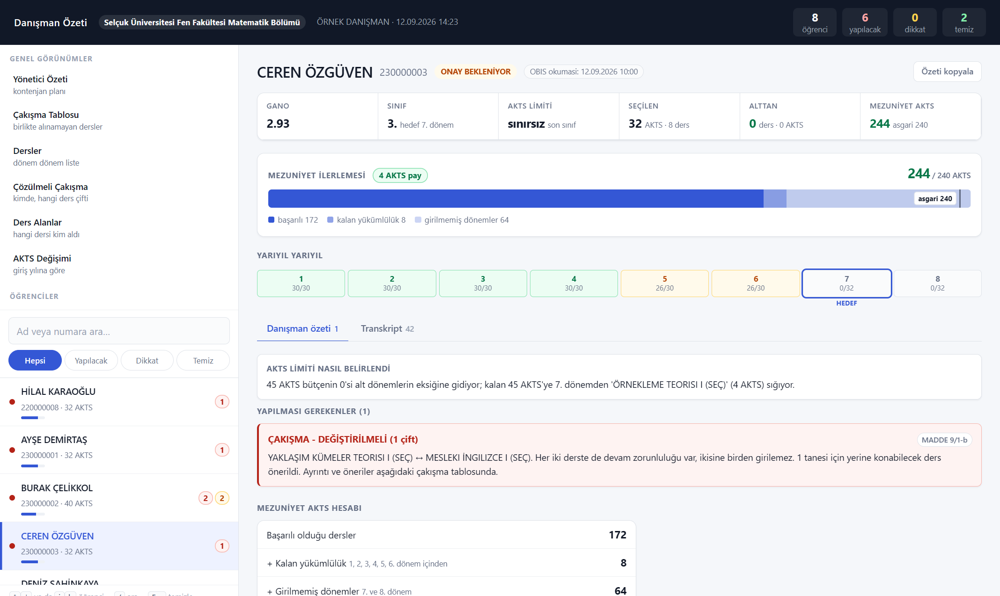
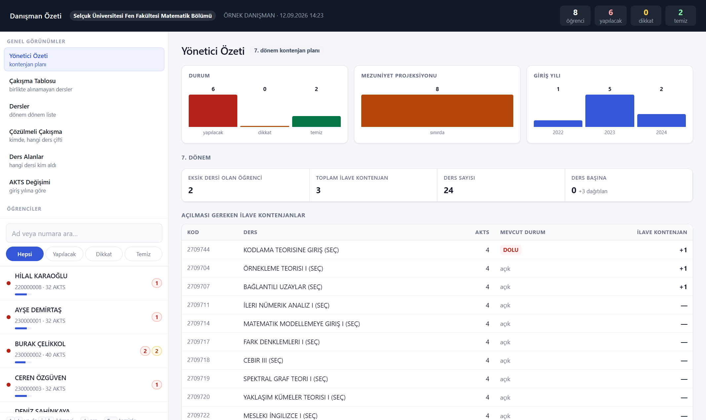
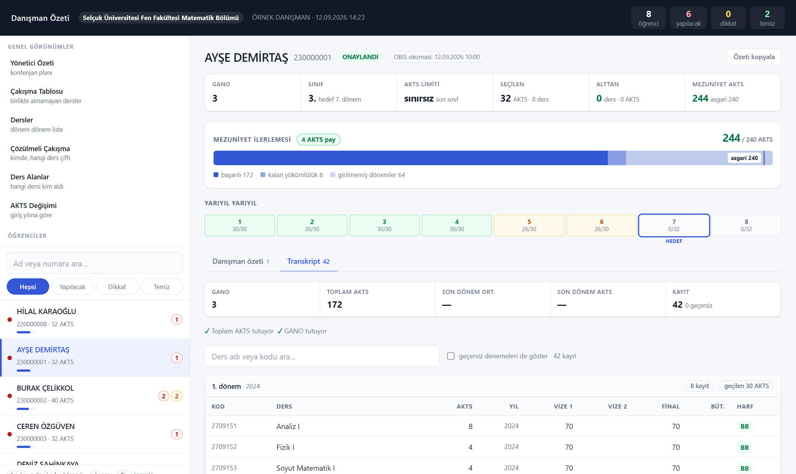
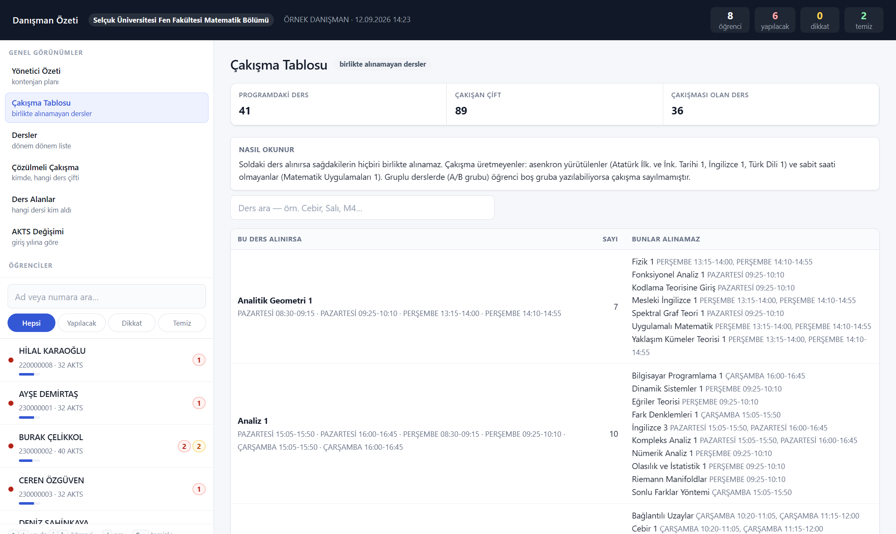
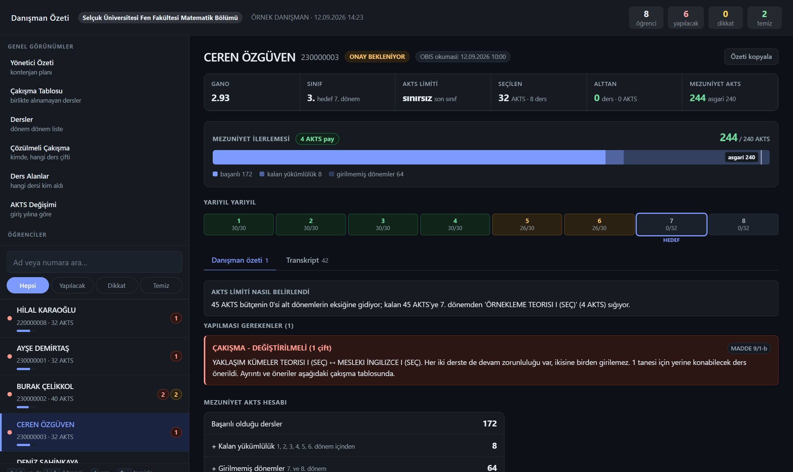

# Danışman Özeti — Ders Kayıt Kontrolü

Ders kayıt döneminde danışmanı olduğunuz öğrencilerin seçimlerini OBİS'ten
okur, **Selçuk Üniversitesi Ön Lisans ve Lisans Eğitim-Öğretim ve Sınav
Yönetmeliği** ile bölümünüzün ders planına göre denetler ve tek dosyalık bir
**danışman özeti panosu** üretir.

> ### Bu araç hiçbir şeyi değiştirmez
> Ders eklemez, çıkarmaz, kaydetmez, onaylamaz, reddetmez. Yalnızca okur ve
> raporlar. Onay/ret kararı danışmanındır. Tek yazma işlemi, açtığı
> öğrencinin **kilidini geri bırakmaktır** — OBİS bir öğrencinin sayfası
> açıldığında onu kilitler, araç her öğrenciden sonra bu kilidi kaldırır.



*Bu depodaki bütün ekran görüntüleri ve örnek pano **uydurma öğrencilerle**
üretilmiştir (`python ornek_uret.py`). Gerçek öğrenci verisi hiçbir yerde
yoktur.*

---

## İçindekiler

- [Neyi çözüyor?](#neyi-çözüyor)
- [Ne yapar, ne YAPMAZ](#ne-yapar-ne-yapmaz)
- [Ekran görüntüleri](#ekran-görüntüleri)
- [Kurulum — adım adım](#kurulum--adım-adım)
- [Panoyu okuma](#panoyu-okuma)
- [Nasıl çalışıyor](#nasıl-çalışıyor)
- [Gizlilik ve öğrenci verisi](#gizlilik-ve-öğrenci-verisi)
- [Testler](#testler)
- [Bilinen sınırlar](#bilinen-sınırlar)

---

## Neyi çözüyor?

Altmış öğrencinin ders seçimini elle denetlemek, her biri için şu soruları
ayrı ayrı sormak demek:

- Bu dönem kaç AKTS alabilir? (GANO'ya bağlı: 30 mu 45 mi, son sınıfsa
  sınırsız mı?)
- Alttan kalan dersini seçmiş mi? Kontenjanı dolu mu?
- Seçtiği iki ders aynı saatte mi? Devamsızlık hakkına sığıyor mu?
- Dönemin zorunlusunu, TOS dersini, gereken sayıda seçmeliyi almış mı?
- 240 AKTS'yi tutturabilecek mi?

Araç bunları tek tek hesaplar, her uyarının **hangi yönetmelik maddesine
dayandığını** yazar ve hepsini tek bir HTML sayfasında toplar. Karar yine
danışmanındır; araç yalnız **tespit** eder.

### En pahalı iki soru

İki şey var ki elle bulunması neredeyse imkânsız:

**1. Müfredat bir dersin AKTS'sini düşürdüyse.** Öğrenci dersi geçtiği
andaki AKTS ile sayılır; yeni alacağı ders güncel AKTS ile. Aradaki fark
mezuniyet toplamından düşer ve öğrenci 240'ın altına inebilir. Kimse
fark etmez, çünkü hiçbir ekranda "eksik" yazmaz.

**2. Müfredat sonradan YENİ bir ders eklediyse.** Eski kohortun planında o
ders yoktur; yarıyılı plandan düşük kapatır ve bu açık yarıyılın kendi
içinde kapanmaz. Öğrenci fazladan seçmeli almadıkça mezun olamaz.

Araç ikisini de **bölümün yıllık "Okutulacak Dersler" belgelerini
karşılaştırarak** bulur (bkz. [Kurulum](#kurulum--adım-adım)).

---

## Ne yapar, ne YAPMAZ

| Yapar | Yapmaz |
|---|---|
| OBİS'ten okur | Ders eklemez / çıkarmaz |
| Yönetmeliğe göre denetler | Kaydetmez |
| Uyarı ve öneri üretir | Onaylamaz / reddetmez |
| Pano üretir | Öğrenciye mesaj göndermez |
| Öğrenci kilidini geri bırakır | Başka hiçbir yazma işlemi yapmaz |

Denetlenen maddeler: **8/4** (mezuniyet AKTS'si), **9/1-a** (alt yarıyıl
önceliği), **9/1-b** (çakışma), **9/1-c** (AKTS üst sınırı), **9/1-d** (not
yükseltme), **9/1-f** (kaldırılan ders), **10/1-2** (devam), **13** (not
sistemi), **14/2** (AKTS), **15/1** (DC şartlı geçer), **16/1** (azami süre),
**3/p** (son sınıf).

---

## Ekran görüntüleri

| | |
|---|---|
| **Öğrenci sayfası** — mezuniyet ilerlemesi, yarıyıl şeridi, uyarı kartları |  |
| **Yönetici özeti** — durum dağılımı ve kontenjan planı |  |
| **Transkript** — yarıyıl yarıyıl tam döküm |  |
| **Çakışma tablosu** — birlikte alınamayan dersler |  |
| **Koyu tema** — işletim sisteminizi izler |  |

Panoyu kendiniz denemek için: `ornek/danisman_ozeti.html` dosyasını
tarayıcıda açın. Sunucu, internet, kurulum gerekmez.

---

## Kurulum — adım adım

### 0. Gerekenler

- **Python 3.9+** — kurulumda *"Add Python to PATH"* kutusunu işaretleyin
- **Google Chrome**
- **OBİS danışman hesabı** (kendi sicil ve şifreniz)

```bash
git clone <bu-deponun-adresi>
cd DersKayitKontrol
pip install -r requirements.txt
```

### 1. Bölümünüzün belgelerini toplayın

```bash
python kurulum.py --belgeler
```

Bu komut neyin istendiğini ayrıntısıyla yazar. Özeti:

| # | Belge | Nereye | Zorunlu mu |
|---|---|---|---|
| 1 | **"Okutulacak Dersler" belgeleri — son 4-5 yıl** (docx) | `veri/mufredat/2022.docx`, `2023.docx`, … | **Evet** (en az 2 yıl) |
| 2 | **Bu yarıyılın ders programı** (xlsx) | `veri/ders_programi.xlsx` | Hayır |

Dosya adındaki yıl, o belgenin geçerli olduğu **giriş yılıdır**.
`2024-2025 Okutulacak Dersler.docx` de olur; baştaki yıl okunur.

**Neden 4-5 yıl?** Çünkü bu, sizden *daha fazla* değil *daha az* şey
istemek demek. Yukarıdaki "en pahalı iki soru"nun cevabı bu belgelerin
içinde zaten yazılı:

- bir yılda **ortaya çıkan** ders → müfredata sonradan eklenen ders
- yıldan yıla **AKTS'si değişen** ders → kohort AKTS tabanı
- bir yılda **kaybolan** ders → kaldırılmış ders

Belgeler yan yana konunca üçü de kendiliğinden çıkar. Aksi hâlde bunları
transkriptleri tek tek karşılaştırarak bulmanız gerekirdi.

> **Tek yıl verirseniz** araç yine çalışır; yarıyıl planı, TOS listesi ve
> dönem kompozisyonu tek belgeden de çıkar. Ama **AKTS kaybı ve kohort
> açığı hesaplanamaz** — karşılaştıracak ikinci yıl yoktur. Araç bunu
> uydurmaz, "hesaplanamadı" der.

### 2. Kurulum sihirbazını çalıştırın

```bash
python kurulum.py
```

Sihirbaz belgelerden türetebildiği her şeyi türetir ve **yalnız
türetemediğini sorar**:

- Fakülte ve bölüm adı; program kaç yıllık (2 / 4 / 5)
- Müfredata sonradan eklenmiş ders varsa, eski kohortun eksik kalan
  AKTS'si hangi yarıyılın seçmeli havuzundan kapatılıyor *(bölüm
  kararıdır, belgede yazmaz)*
- Ders programında sabit buluşma saati olmayan dersler *(asenkron ortak
  zorunlular, öğrenciyle ayarlanan uygulamalar)* — bunlar çakışma üretmez
- Laboratuvar/uygulama dersleri — devamsızlık hakları %30 değil %20
  (MADDE 10/1)

Ders programı xlsx'inin sayfa adını ve saat sütunlarını sihirbaz kendisi
bulur.

Sonuç `veri/bolum.json` dosyasıdır — **bölüm profili**. Kod düzenlemeniz
gerekmez.

```bash
python kurulum.py --denetle    # elde ne var, ne eksik
python bolum.py --denetle      # profil kendi içinde tutarlı mı
```

> **Türetemediğimiz hiçbir şeyi uydurmayız.** Matematik'in değerini başka
> bir bölüme varsayılan diye koymak, sessizce yanlış AKTS hesaplamak
> demektir. Eksik kalan her alan raporda açıkça *"siz doldurun"* diye
> durur; profil eksikse program **açılmaz**.

### 3. Giriş bilgilerinizi yazın

```bash
cp .env.example .env
```

`.env` dosyasına kendi OBİS sicil numaranızı ve şifrenizi yazın. Bu dosya
`.gitignore` içindedir, git'e **girmez**; kodda hiçbir yerde şifre yazılı
değildir.

### 4. İlk taramayı yapın

```bash
python baslat.py
```

Araç **sicil/şifre sormadan ÖNCE** hangi bölüm ve hangi belgelerle
çalışacağını yollarıyla gösterip teyit ister:

```
  BÖLÜM     : Selçuk Üniversitesi Fen Fakültesi Matematik Bölümü
  Okutulacak Dersler belgeleri:
      2026 girişliler    ...\veri-yerel\mufredat\2026.docx
  Ders programı:
      ...\veri-yerel\ders_programi.xlsx

  Bu belgelerle devam edilsin mi? [e / h / i]
```

**`h`** derseniz belgelerinizi orada verebilirsiniz — yukarıdaki 1. ve 2.
adımı önceden yapmanız şart değil. Belgeler tek tek istenir (istediğiniz
kadar, `tamam` ile biter), her biri **alınır alınmaz çözümlenir** ve ne
okunduğu yazılır; anlaşılmayan belge kabul edilmez. Her belgenin **giriş
yılı teyit ettirilir** — asla sessizce tahmin edilmez.

Belgeleriniz programın yanındaki `veri-yerel/` klasörüne kalıcı olarak
yazılır. Kurulum bitince program yeniden başlar.

Bu soru, **belgeler değişmediği sürece** bir daha sorulmaz.

Sonra OBİS'e girer, danışmanı olduğunuz öğrencileri tek tek açar, okur,
kilidi bırakır ve `cikti/danisman_ozeti.html` dosyasını üretip açar.
Chrome penceresini kapatmayın; tarama öğrenci sayısına göre birkaç dakika
sürer.

### Sonraki çalıştırmalar

| Durum | Komut |
|---|---|
| Güncel veri istiyorum | `python ders_kayit.py --tumu --pano --html` |
| Bir öğrenciyi düzelttim, sadece onu tazele | `python ders_kayit.py --ogrenci 230000003` |
| Kural değişti, veri aynı | `python panoyu_yenile.py` |
| Ders programı yenilendi | `python ders_programi.py` |
| Müfredat belgesi yenilendi | `python mufredat.py` |
| Müfredat arşivi değişti | `python mufredat_arsivi.py --json` |
| Belgeleri baştan vereceğim | `python baslat.py` → `h` |
| Her şey yerinde mi? | `python baslat.py --tani` |

Ayrıntılı kullanım: **[KULLANIM.md](KULLANIM.md)**

---

## Panoyu okuma

Pano tek bir HTML dosyasıdır — sunucu, internet, kütüphane gerekmez.
Çift tıklayıp açabilirsiniz.

- **Sol panel** — öğrenciler; ad/numara araması, *Yapılacak / Dikkat /
  Temiz* süzgeçleri. Adın altındaki ince şerit kazanılmış AKTS'nin plana
  oranıdır.
- **Mezuniyet ilerlemesi** — mezuniyet AKTS'sinin dört parçası orantıyla:
  *başarılı*, *kalan yükümlülük*, *girilmemiş dönemler*, *plana
  ulaşılamayan* (kırmızı). Çizgi yönetmelik asgarisini gösterir.
- **Yarıyıl yarıyıl** — sekiz yarıyıl tek satırda. Yeşil = plan dolmuş,
  sarı = girilmiş ama eksik, **kırmızı = yarıyılın kendi içinde kapanmayan
  açık**, gri = henüz girilmemiş.
- **Uyarı kartları** — her birinde dayandığı madde yazılı.
- **Özeti kopyala** — öğrencinin uyarılarını düz metin olarak panoya
  kopyalar; görüşmede e-postaya yapıştırabilirsiniz.
- **Klavye** — `↑` `↓` ya da `j` `k` gezinir, `/` aramaya atlar,
  `Esc` temizler.
- **Yazdırma** — sayfa yazdırılabilir; yan panel çıkmaz, kaydırmalı
  tablolar açılır.

---

## Nasıl çalışıyor

```
  OBİS  ──►  ders_kayit.py      Selenium ile okur, HTML'i çözer
                  │
                  ▼
             ozet.py            Kural motoru: uyarıları üretir
                  │
       ┌──────────┼──────────┐
       ▼          ▼          ▼
 yonetmelik.py  bolum.py  ders_programi.py
 (üniversite)   (bölüm)   (çakışmalar)
                  │
                  ▼
             rapor.py           Tek dosyalık HTML pano
```

| Dosya | Sorumluluk |
|---|---|
| `yonetmelik.py` | Yönetmelik kuralları. Her sabitin yanında dayandığı madde yazılı. **Selçuk'un tamamı için aynıdır.** |
| `bolum.py` | **Bölüm profili** (`veri/bolum.json`): yarıyıl planı, TOS listesi, dönem kompozisyonu, sonradan eklenen dersler, ders programı düzeni. Bölümden bölüme değişen her şey burada. |
| `kurulum.py` | Kurulum sihirbazı: belgelerden türetir, yalnız türetilemeyeni sorar. |
| `mufredat.py` / `mufredat_arsivi.py` | "Okutulacak Dersler" belgesini çözer; yıllar arası değişimleri çıkarır. |
| `ozet.py` | Kural motoru. Ders kaydı + transkript + yönetmeliği birleştirip uyarı üretir. |
| `rapor.py` | Panoyu yazar. Veri sayfaya gömülür. |
| `akts_degisimi.py` | AKTS'si değişmiş dersleri **giriş yılı (kohort) başına** çıkarır. |
| `ders_programi.py` | Ders programı xlsx'ini çözer, çakışan ders çiftlerini bulur. |
| `yollar.py` | Dosya yolları; exe içinde okunan/yazılan kökleri ayırır. |
| `paylas.py` | Başka bir danışmana verilebilecek temiz kopya hazırlar. |
| `exe_yap.py` | Tek dosyalık `DanismanOzeti.exe` üretir. |

### Tasarım ilkeleri

**Sessiz yanlış, gürültülü hatadan beterdir.** Bölüm profili yoksa program
açılmaz. Belge okunup da anlaşılmazsa istisna atılır — ne okunduğu ve
neyin beklendiği yazılır. Ders programından hiç ders çıkmazsa durur.
Transkriptten hesaplanan GANO OBİS'in yazdığıyla tutmuyorsa uyarı çıkar.
Hiçbir yerde "varsayılan değere düşme" yoktur.

Bu ilke ölçülerek uygulandı. Belge okuyucuları bir zamanlar altı ayrı
şablon farkında **sessizce boş ya da yanlış** sonuç veriyordu: farklı
sütun sırasında AKTS yanlış sütundan okunuyor, arap rakamlı yarıyıl
başlığı hiç tanınmıyor, bir sütun kaymış ders programı **sıfır çakışma**
üretiyordu. Hiçbirinde istisna atılmıyordu.

**Tümü-ya-da-hiç yapılandırma.** Danışmanın verdiği belgeler
`veri-yerel/` klasörüne yazılır ve ancak kurulum **damgası** atıldığında
devreye girer. Yarım kalmış kurulum yok sayılır. Dosya başına "yoksa
gömülüye dön" olsaydı, bir bölümün planı + başka bölümün ders kataloğu
gibi karışık bir yapılandırma oluşur ve hiçbir denetim bunu yakalayamazdı.

**Uydurma üretmeyiz.** Arşivin en eski yılında zaten duran bir ders
"sonradan eklendi" sayılmaz — öncesini bilmiyoruz. Kohortun AKTS tabanı
bilinmiyorsa "değişmemiş" kabul edilir, kayıp uydurulmaz.

**Ölçülmüş kaynak belgesel kaynağın önündedir.** Bir dersin eski AKTS'si
aranırken sıra: öğrencinin kendi transkript kaydı → kohort fotoğrafı →
o yıl yürürlükte olan müfredat belgesi → "değişmemiş".

---

## Gizlilik ve öğrenci verisi

- **Öğrenci verisi bilgisayarınızdan çıkmaz.** Araç yalnız OBİS'e bağlanır;
  başka hiçbir sunucuya veri göndermez, telemetri yoktur.
- `cikti/` klasörü (pano, ham sayfalar), `.env` (şifreniz) ve
  `chrome-profili/` (oturum çerezleriniz) `.gitignore` içindedir.
- `paylas.py` başka bir danışmana kopya hazırlarken bu üçünü **dışarıda
  bırakır** ve kopyaladığı her dosyayı tek tek ekrana yazar.
- Bu depodaki örnek pano ve ekran görüntüleri tamamen uydurma verilerle
  üretilmiştir; kaynakta gerçek biçimli tek bir öğrenci numarası yoktur
  ve bu **testle korunur** (`test_pano.py`).
- Kişisel verinin işlenmesi KVKK kapsamındadır. Aracı yalnız kendi
  danışmanlık göreviniz kapsamında, kendi OBİS yetkinizle kullanın;
  ürettiği panoyu yetkisiz kişilerle paylaşmayın.

---

## Testler

```bash
cd testler
python test_kurallar.py     # yönetmelik kuralları
python test_bolum.py        # bölüm profili gerçekten okunuyor mu
python test_arsiv.py        # çok yıllı müfredat arşivi
python test_kurulum.py      # yeni bir bölüm sıfırdan kurulabiliyor mu
python test_kaynaklar.py    # belge toplama akışı
python test_yollar.py       # yerel kurulum katmanı (veri-yerel)
python test_pano.py         # özet motoru + panoyu node ile çizdirir
python test_transkript.py   # transkript çözümleyici
python test_eslestirme.py   # eski kod / yeni kod eşleştirmesi
python test_program.py      # ders programı ve çakışmalar
python test_mufredat.py     # müfredat belgesi ve AKTS değerleri
python test_kohort.py       # giriş yılına göre AKTS tabanı
```

**Testler neyi koruyor?** Geçen test bir şey kanıtlamaz; kırılınca kızmayan
test hiçbir şey korumuyordur. Bunu ölçmek için kodu kasten bozup testleri
koşuyoruz (*mutasyon denemesi*): AKTS limitini 45'ten 60'a çekmek, mezuniyet
asgarisini 240'tan 200'e indirmek, bölüm planını koda geri kaçırmak, arşivi
AKTS kaybı hesabından koparmak gibi. Kaçan her mutasyon için test yazılır.

`test_pano.py`, sistemde `node` varsa panonun JavaScript'ini **gerçekten
çalıştırır** ve her görünümü çizdirir — `rapor.py` içindeki sayfa şablonu
ham olmayan bir Python dizgisidir ve içine kaçan tek bir ters eğik çizgi
sayfayı hiçbir hata vermeden bomboş açtırır.

---

## Bilinen sınırlar

- **Yalnız Selçuk Üniversitesi OBİS'i.** Sayfa yapısı değişirse
  `ders_kayit.py` güncellenmelidir.
- **Windows'ta geliştirildi ve sınandı.** Linux/macOS'ta çalışması
  beklenir ama denenmedi; `exe_yap.py` yalnız Windows içindir.
- **Exe bölüme özgüdür.** Müfredat, ders programı ve bölüm profili exe'nin
  *içine* gömülür. Başka bir bölüme vermeden önce o bölümün belgeleriyle
  kurulum yapıp yeniden derleyin. Açılış ekranı ve pano başlığı hangi
  bölüm için yapılandırıldığını yazar.
- **Yalnız Matematik bölümünde gerçek veriyle çalıştırılmıştır.** Başka
  bölümlerin belgeleriyle kurulum, sentetik belgelerle sınanmıştır
  (`test_kurulum.py`); gerçek bir başka bölüm verisiyle denenmedi.
- **Araç karar vermez.** Ürettiği her uyarı bir tespittir; onay/ret kararı
  ve sorumluluğu danışmana aittir.

---

## Katkı

Sorun bildirimi ve öneri için issue açabilirsiniz. Kod değişikliği
gönderiyorsanız ilgili testi de ekleyin — bu depoda testsiz kural
değişikliği kabul edilmiyor, çünkü yanlış bir AKTS hesabı kimsenin fark
etmeyeceği bir hatadır.

## Lisans

[MIT](LICENSE). Serbestçe kullanabilir, değiştirebilir ve
dağıtabilirsiniz.

Araç bir **karar destek** aracıdır: ürettiği her uyarı bir tespittir,
onay/ret kararı ve sorumluluğu danışmana aittir. Yazılım "olduğu gibi"
sunulur; kullanımından doğan sonuçlardan yazar sorumlu değildir.
